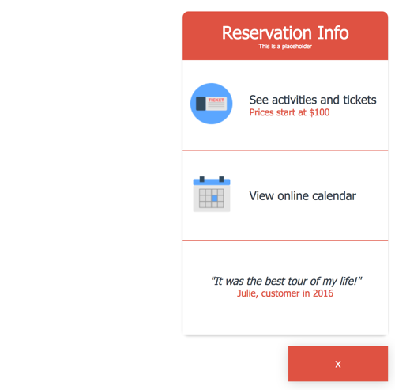

## FareHarbor Toolkit

Built by: Graham Nessler and Ryan Westlake

See our more extensive [Gitbook documentation](https://www.gitbook.com/book/rcwestlake/fareharbor-toolkit/details)

This is a project built for FareHarbor, an online travel services company. It consists of a series of files that allow FareHarbor to easily create and customize booking tools for client sites. We also created three customizable tools: a bottom modal tool, a search input tool, and a footer tool.

This project drew deeply on object-oriented programming practices. Essentially, our config tools are a series of objects that pass properties (such as background color and text) to different tools, allowing for easy customization.

The project is also extensively tested with over twenty passing feature tests.

Core tools used: JavaScript, Selenium Webdriver, ExpressJS.

## See Our Project

## Installation and Setup Instructions

To use these tools, please visit our [FareHarbor Documentation](https://www.gitbook.com/book/rcwestlake/fareharbor-toolkit/details) for the Toolkit.

## Reflection

We succeeded in building a powerful tool creator for FareHarbor, along with three highly customizable tools. This project taught us a lot in a number of areas. For instance, due to backwards compatibility concerns, we built the entire project in vanilla JavaScript/ES5. This includes all the styling and markup. This was an extremely useful exercise in the fundamentals and it definitely taught us not to take our "power tools" like React (or even jQuery) for granted.

Secondly, we had to build a small server to get around a CORS issue with displaying the proper API data. This allowed us to learn about ExpressJS and the fundamentals of server building, as well as strengthening our knowledge of API calls. Moreover, due to the aforementioned need for vanilla JS, we taught ourselves how to make an API call with the XMLHTTPRequest() object, as opposed to using an AJAX library. This was also very useful as it impelled us to get inside of the API call process and build this up the old fashioned way without relying on a library.

This project also made extensive use of Selenium Webdriver for testing. We became more adept testers as a result, especially since we had to adapt our tests for contingencies such as different company names.

Finally, the project was a very useful learning experience in business needs and their applications to software development. We built these tools and the tool creator with the needs of FareHarbor's clients in mind, and specifically the imperative to increase conversion rates. This impacted everything from aesthetic choices to how the links are accessed in the code.

Many thanks to FareHarbor and Adam Hundley for giving us the opportunity to undertake this project.
